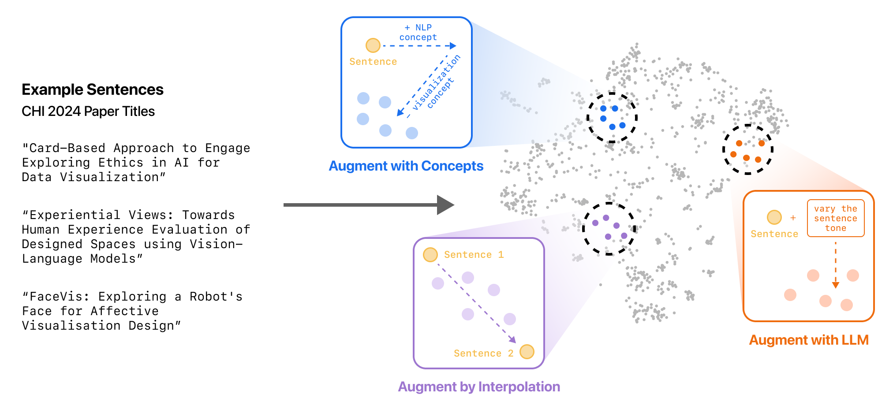

# Interactive Data Augmentation

Amplio is an interactive research tool for data augmentation. The system visualizes the embeddings of input sentences and helps users systematically explore and fill in "empty data spaces," i.e., parts of the desired dataset distribution with few or no data points. To do this, Amplio includes a suite of three human-in-the-loop methods for augmenting unstructured text datasets: *Augment with LLM*, *Augment by Interpolation*, and *Augment with Concepts*. 



This code accompanies the research paper:

**Exploring Empty Spaces: Human-in-the-Loop Data Augmentation**  
Catherine Yeh, Donghao Ren, Yannick Assogba, Dominik Moritz, Fred Hohman  
*arXiv, 2024.*  
Paper: https://arxiv.org/abs/2410.01088

## Demo and Development Setup

The system setup requires running two main components: (1) the backend server and (2) the frontend interface. The backend and frontend run on separate servers. 

First, create a secrets file and install the pipenv environment.

### Secrets File

To add your API key, duplicate `secrets_example.json` and rename it to `secrets.json`. Then copy and paste your own API keys in `secrets.json`.

### Install Requirements

Install pipenv:

```
pip install pipenv
```

Build requirements for project:

```
pipenv install
```

Start virtual env:
```
pipenv shell
```

### Backend

Navigate into [backend](backend) folder:

```
cd backend
```

Start the backend server:

```
python server.py
```

The server should now be running at [`127.0.0.1:5000`](http://127.0.0.1:5000).

### Frontend

After the backend server is running, in a separate terminal window, navigate into [frontend](frontend) folder:

```
cd frontend
```

Install dependencies:

```
npm install
```

Start frontend development server:

```
npm run dev
```

The interface should now be live at [`localhost:5173`](http://localhost:5173).

## Data and Models

All data needed to run the system is available in the [data](data) folder. This data was generated using **Python 3.11**.

Similarly, all models needed to run the system are available in the [models](models) folder.

**Note:** you may run into issues if your Python version != 3.11. In this case, please run the [data/generate_data.ipynb](data/generate_data.ipynb) notebook to regenerate the data and model files needed to run the demo. You can also use this notebook to add new datasets.

### Adding a New Dataset

If you add a new dataset you will need to update these files:

* [backend/server.py](backend/server.py)
* [frontend/src/routes/components/LeftSidebar.svelte](frontend/src/routes/components/LeftSidebar.svelte)

Look for the sections marked with `UPDATE HERE IF YOU ADD A NEW DATASET`.

Similarly, if you want to remove a dataset from the system, you will need to edit the files above.

## Contributing

When making contributions, refer to the [`CONTRIBUTING`](CONTRIBUTING.md) guidelines and read the [`CODE OF CONDUCT`](CODE_OF_CONDUCT.md).

## BibTeX

To cite our paper, please use:

```bibtex
@article{yeh2024exploring,
    title={{Exploring Empty Spaces: Human-in-the-Loop Data Augmentation}},
    author={Yeh, Catherine and Ren, Donghao and Assogba, Yannick and Moritz, Dominik and Hohman, Fred},
    journal={arXiv preprint arXiv:2410.01088},
    year={2024},
    doi={10.48550/arXiv.2410.01088}
}
```

## License

This code is released under the [`LICENSE`](LICENSE) terms.
